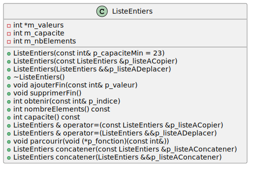

# Module 04 - Gestion de la mémoire

## Exercice 1 - Un peu de dessin

Le but de cet exercice est de bien comprendre les liens entre les variables, les pointeurs et la mémoire.

### Exercice 1.1

Dessinez ce qui se passe en mémoire à chaque ligne de code suivante :

```cpp
int valeurs[] = { 1, 2, 3, 4, 5 };
int* ptr = valeurs;
ptr += 2;
*ptr = 42;
```

### Exercice 1.2

Dessinez ce qui se passe en mémoire à chaque ligne de code suivante :

```cpp
Voiture voiture;
Voiture* pvoiture = new Voiture();
pvoiture = &voiture;
delete pvoiture;
```

Autres questions :

- Y a-t-il une fuite mémoire ? Pourquoi ?
- Y a-t-il un problème de pointeur ? Pourquoi ?

## Exercice 2 - Liste d'entiers

Le but de cet exercice est de créer une liste d'entiers. La liste va être créée à partir d'un tableau d'entiers dynamique. La capacité minimum de cette liste est de 23 éléments. La liste va être implémentée à l'aide de la structure suivante :



### Exercice 2.1 - Implémentation de la classe `ListeEntiers`

Implantez les méthodes du diagramme :

- `ListeEntiers(const int& p_capaciteMin = 23)` : Constructeur par défaut, initialise la liste à vide avec une capacité de 23 éléments minimum.
- `ListeEntiers(const ListeEntiers &p_listeACopier)` : Constructeur par copie, copie les éléments de la liste passée en paramètre.
- `ListeEntiers(ListeEntiers &&p_listeADeplacer)` : Constructeur par déplacement, déplace les éléments de la liste passée en paramètre.
- `~ListeEntiers()` : Destructeur, libère la mémoire allouée pour le tableau d'entiers.
- `void ajouterFin(const int& p_valeur)` : Ajoute un élément à la fin de la liste. Si la capactié est atteinte, le tableau est agrandi par le double de sa capacité.
- `void supprimerFin()` : Supprime le dernier élément de la liste.
- `int obtenir(const int& p_indice)` : Retourne la valeur à l'indice donné en paramètre.
- `int nombreElements() const` : Retourne le nombre d'éléments dans la liste.
- `int capacite() const` : Retourne la capacité de la liste.
- `ListeEntiers & operator=(const ListeEntiers &p_listeACopier)` : Opérateur d'affectation par copie, copie les éléments de la liste passée en paramètre.
- `ListeEntiers & operator=(ListeEntiers &&p_listeADeplacer)` : Opérateur d'affectation par déplacement, déplace les éléments de la liste passée en paramètre.
- `void parcourir(void (*p_fonction)(const int&))` : Parcourt la liste et applique la fonction passée en paramètre à chaque élément de la liste.
- `ListeEntiers concatener(const ListeEntiers &p_listeAConcatener)` : Concatène dans une nouvelle liste la liste courante suivie de la liste passée en paramètre.
- `ListeEntiers concatener(ListeEntiers &&p_listeAConcatener)` : Concatène dans une nouvelle liste la liste courante suivie de la liste passée en paramètre. Vous devez utiliser le constructeur par déplacement si le nombre total d'éléments est inférieur à la capacité totale de la rvalue.

### Exercice 2.2 - Tests de la classe `ListeEntiers`

Créez un programme qui permet de tester les méthodes de la classe `ListeEntiers`. Le programme doit permettre de :

- Créer une liste d'entiers vide.
- Ajouter des entiers à la fin de la liste.
- Supprimer des entiers à la fin de la liste.
- Tester les opérateurs d'affectation par copie et par déplacement.
- Tester le constructeur par copie et par déplacement.
- Afficher la liste.

### Exercice 2.3 - Exercices optionnels

Ajoutez les fonctionnalités suivantes à votre liste :

- `void ajouterDebut(const int& p_valeur)` : Ajoute un entier au début de la liste.
- `void inserer(const int& p_valeur, const int& p_indice)` : Insère un entier à la position donnée en paramètre.
- `void supprimerDebut()` : Supprime l'entier du début de la liste.
- `void supprimer(const int &p_indice)` : Supprime l'entier à l'indice donné.
- `void trier()` : Tri la liste d'entiers
- `int chercher(const int& p_valeur)` : Recherche la position de p_valeur dans la liste. Si non trouvée, renvoyer -1.
- `bool estDansListe(const int& p_valeur)` : Renvoie vrai si la valeur est dans la liste, faux sinon.
